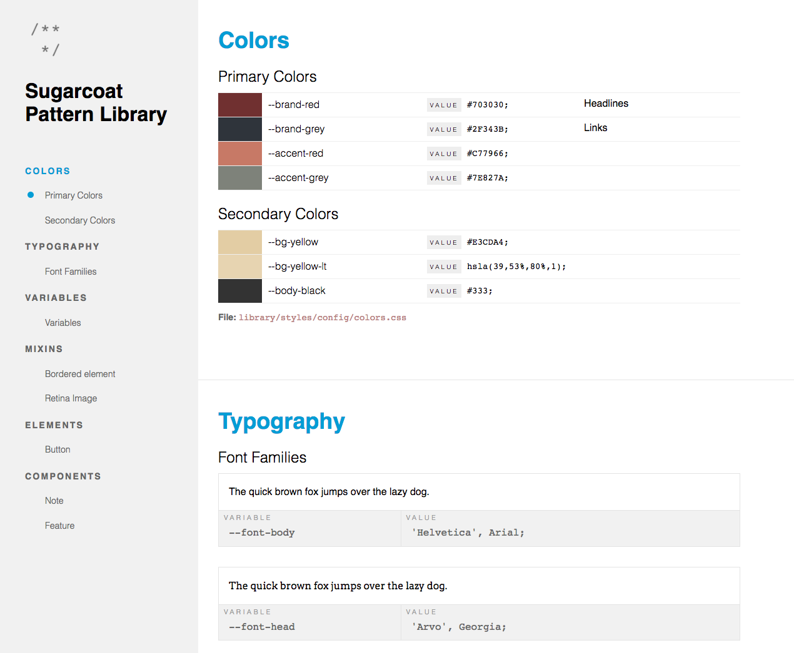
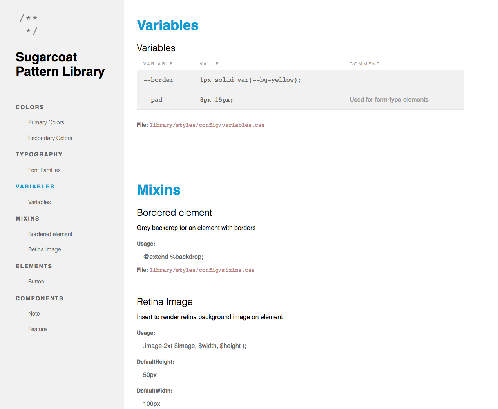

# Sugarcoat #

[](https://www.npmjs.com/package/sugarcoat) [](https://david-dm.org/sapientnitrola/sugarcoat)

Making UI documentation a bit sweeter ✨

Sugarcoat was created to enable developers to produce rich UI documentation easily and with minimal up-keep. Sugarcoat works by parsing project files for documentation comments (similar to JavaDoc, JSDoc, etc.) and generates a responsive HTML site or JSON that is organized and easy to read. Sugarcoat allows developers and designers access to up-to-date previews of UI elements, page components, project specific colors and typography, all in one place.

**Note**: This is still a [work in-progress](#v100). Please file an issue if you encounter any issues or think a feature should be added.






See our [example project](https://github.com/sugarcoat/sugarcoat-example-project) to get a better view of Sugarcoat up and running.


# Index #

  - [Features](#features)
  - [Install](#install)
  - [Usage](#usage)
    - [Module](#module)
    - [CLI](#cli)
  - [Configuration](#configuration)
    - [`sections` Array](#sections-array)
    - [Standardized File Format](#standardized-file-format)
  - [Code Comment Syntax](#code-comment-syntax)
  - [Example Project](https://github.com/sugarcoat/sugarcoat-example-project)


---

# Features✨ #

1. Lives in your project seamlessly

  Sugarcoat will never force a file/project structure on you, nor make you create extra files for it to work.

2. [Universal Comment Syntax](#code-comment-syntax)

  Sugarcoat parses all **comment blocks** in the file(s) you specify with JSDoc commenting syntax. Or you can specify your own delimiters.

3. [Easy-to-identify component states](#code-comment-syntax)

  If you declare CSS modifier states within your comment block, Sugarcoat will highlight and display them in your pattern library for extra readability.

4. [Variables Galore](#type)

  Sugarcoat will understand your variables if they're SCSS, LESS, or [CSS Custom Property](https://www.w3.org/TR/css-variables/#defining-variables)


# Install #

```bash
npm install --save sugarcoat
```


# Usage #


The Sugarcoat module takes a `config` object and returns a `Promise`. By default, the `resolve` callback provided to the `.then` method receives the expanded `config` object with the parsed sections data. If there are any errors within Sugarcoat, it will reject the promise, passing back the first error as an `Error` object. The user can then handle the error as needed. (It is easiest if a `.catch` is added to end of the sugarcoat promise which will catch any errors.)


```js
const sugarcoat = require( 'sugarcoat' );

sugarcoat( config ).catch( errorObj => {
  // handle errors here
});

// or

sugarcoat( config ).then( data => {
    console.log( data );
}).catch( errorObj => {
  // handle errors here
});
```

# Configuration #


**Simple Example**

```js
{
  dest: 'path/to/dest',
  sections: [
    {
      title: 'Base',
      files: [
        'path/to/styles/typography/*.css'
        'path/to/styles/variables/*.css'
      ]
    },
    {
      title: 'UI',
      files: 'path/to/styles/molecules/**/*.css'
    }
  ]
}
```

## `dest` ##

  - Required: Yes
  - Type: `String`
  - Default: `null`
  - Relative: `process.cwd()`

Directory to which Sugarcoat will output the results. This path is relative to `cwd`. Sugarcoat will create any directories that do not already exist. If given the option 'none', Sugarcoat will not output a rendered pattern library.

## `copy` ##

  - Required: No
  - Type: [Standardized File Format](#standardized-file-format)
  - Default: `null`

Static asset file(s) to copy to `dest`. If you would like to use Sugarcoat's default pattern library assets, as well as your own, just include `sugarcoat` in the asset array.

## `include` Object ##

CSS and JavaScript to insert into default template. All CSS Rules are prefixed to prevent style bleed.

### `include.css` ###

  - Required: No
  - Type: [Standardized File Format](#standardized-file-format)
  - Default: `null`

CSS file(s) you wish Sugarcoat to prefix with `template.selectorPrefix`. The newly prefixed stylesheets will be placed in your document in the order you declare them.

### `include.js` ###

  - Required: No
  - Type: [Standardized File Format](#standardized-file-format)
  - Default: `null`

JS Files you wish Sugarcoat to include in the script tag at the footer of your pattern library.

## `display` Object ##

Used to set display values in your template

### `display.graphic` ###

  - Required: No
  - Type: `String`
  - Default: `null`

Path to the image to be rendered in the heading of your pattern library.

### `display.title` ###

  - Required: No
  - Type: `String`
  - Default: `Pattern Library`

String to be used in the `<title>` tag


### `display.headingText` ###

  - Required: No
  - Type: `String`
  - Default: `null`

String to be used in the `<h1>` tag


## `template` Object ##

For advanced configurations and custom templatization.

### `template.partials` ###

  - Required: No
  - Type: `Object`
  - Default: See example below

Replace default partials and register custom partials by providing a path.

**Example:**

```js
partials: {
    'head': 'my-custom-partials/head.hbs', // Replaces head partial with your path provided
    'nav': '', // Uses Sugarcoat default partial
    'footer': '',
    'section-color': '',
    'section-typography': '',
    'section-variable': '',
    'section-default': '',
    'my-custom-partial': 'my-custom-partials/custom.hbs' // Declares custom partial with your path provided
}
```

### `template.helpers` ###

  - Required: No
  - Type: `Object` containing `Functions`
  - Default: `require( 'sugarcoat/lib/handlebars-helpers.js' )`

Register custom helpers. Requires a value in `template.layout` and/or `template.partials`

**Example:**

```js
helpers: {
    someHelper: fn() {}
},
// or
helpers: require( 'my-big-file-full-of-helpers' ),
```

### `template.layout` ###

  - Required: No
  - Type: `String`
  - Default: `main.hbs` (provided by Sugarcoat)

Path to the Handlebars layout that will define the layout of the site.

### `template.selectorPrefix` ###

  - Required: No
  - Type: `String` (CSS selector)
  - Default: `.sugar-example`

Define the selector to be used to prefix all assets in `copy`. Requires a value in `include.css` and either a value in `template.layout` or `template.partials`.

## `sections` Array ##

Contains an `Array` of [Section Objects](#section-object).

### Section Object ###

Each section object in the sections array is rendered as a category. Each comment block within all files in your section object is rendered as a subcategory. You can modify the `mode` Sugarcoat uses to parse the files in your section object, as well as the `template` it uses to render the parsed data.

### `files` ###

  - Required: Yes
  - Type: [Standardized File Format](#standardized-file-format)

File(s) to parse for [documentation comments](#code-comment-syntax). Sugarcoat uses [globby](https://www.npmjs.com/package/globby) to enable pattern matching.


### `title` ###

  - Required: Yes
  - Type: `String`

Heading of the section.

### `mode` & `template` ###

#### `mode` ####

  - Required: No
  - Type: `String`
  - Default: `undefined`

By default, all files are parsed only for their comment blocks. By using `'variable'` mode, Sugarcoat will parse your stylesheet's variable declarations as well. This works with variables prefixed with `$`, `@`, or `--`, depending on the stylesheet's file extension.

#### `template` ####

  - Required: No
  - Type: `String`
  - Default: `'section-default'`

The default partial name used to display parsed comments is `section-default`. If `mode` is provided, the default partial name used is `section-variable`. `mode` has two alternate variable renderings available: `section-color` and `section-typography`.

**Relationship Table**

| `mode`     | Default `template` | Alternate `template` | Description       |
|------------|--------------------|----------------------|-------------------|
| undefined  | 'section-default'  |                      | Parse comment block only |
| 'variable' | 'section-variable' |                      | Parse file content for variables and renders a simple table. Inline comments are treated as the variable's description. Groups of variables can be divided in a file by a comment block. |
| 'variable' |                    | 'section-color'      | Same as 'section-variable', except variables are rendered as swatches |
| 'variable' |                    | 'section-typography' | Same as 'section-variable', except font-family styles are applied to sample text |


**Examples**

Parse all variables in my file:

```js
{
    title: 'Project Defaults',
    files: 'path/to/global/vars.scss',
    mode: 'variable'
}
```

Parse all variables in my file and render them using the 'section-color' partial:

```js
{
    title: 'Colors',
    files: 'path/to/global/colors.scss',
    type: 'variable',
    template: 'section-color'
}
```


## Standardized File Format ##

Throughout Sugarcoat we use a standardized format for files. This format allows the user to express a file in three different ways: `String`, `Array`, and `Object`.

### `String` ###

A path or pattern [(Globby)](https://github.com/sindresorhus/globby#globbing-patterns) to a location.

**Example**
```js
files: 'path/to/js/*'
```

### `Array` ###

Provide a series of Standardized File Formats ([`Strings`](#string) and/or [`Objects`](#object)).

**Example**
```js
files: [
  'path/to/main.js',
  {
    src: 'path/to/main.js',
    options: {
      nodir: true
    }
  }
]
```

### `Object` ###

Provide more globbing options in addition to the standardized patterns. See [Globby](https://github.com/sindresorhus/globby).


**Example**
```js
files: {
  src: 'path/to/main.js',
  options: {
    nodir: true
  }
}
```

# Code Comment Syntax #

```css
/**
 * @title Tooltip
 * @example
 *  <div class="tooltip">
 *    <span class="tooltip-content">This is a tooltip</span>
 *  </div>
 * @modifier .active enabled class on .tooltip
 * @state :focus allows visual contrast for accessibility
 */
```


Sugarcoat will parse any tag it finds into a key/value pair. For example: `@tag value`.

The exception being the following three reserved tags that are demonstrated in the above example:

  - **`@example`** Takes a single or multiline code example.

  - **`@modifier`** Used for a class modifier on a component: `@modifier <selector> <description>`.

  - **`@state`** Used for state pseudo-classes such as `:hover`: `@state :<pseudo-class> <description>`.


**HTML**

For html files, Sugarcoat uses the same comment style. Since HTML doesn't support this style you'll need to wrap your documentation comments with an HTML-style comment.

**Comment Example (html)**

```html
<!--
/**
 * @title Some Component
 * @description This component has a description
 * @dependencies /path/to/some-component.js
 */
-->
<div class="some-component">
  <span>I'm a Component!</span>
</div>
```
